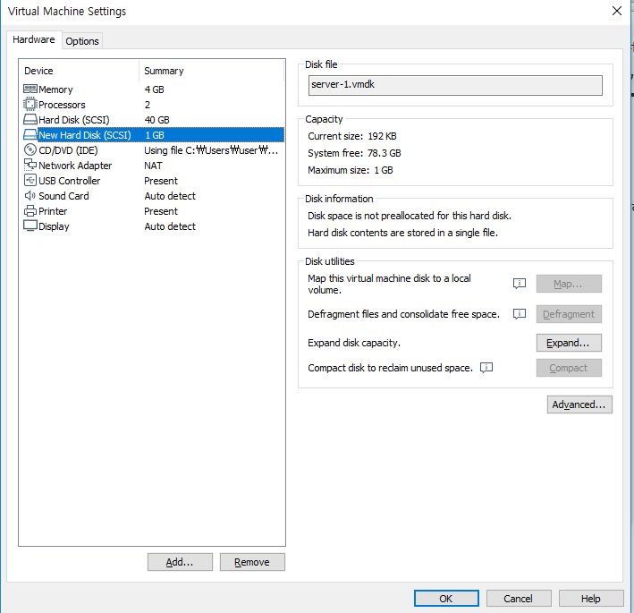
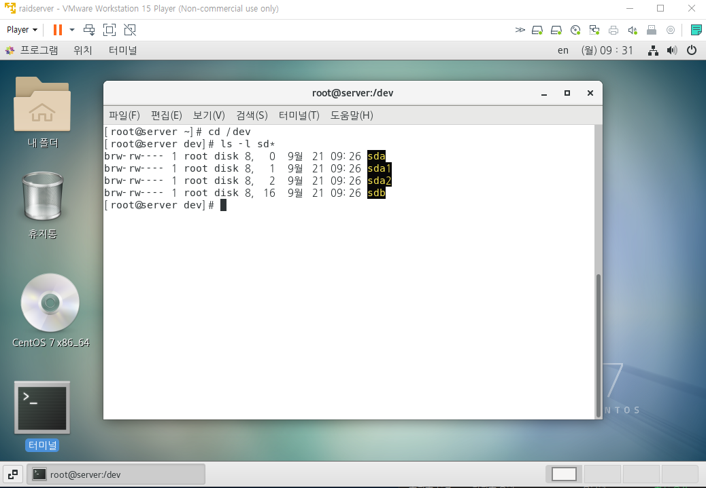
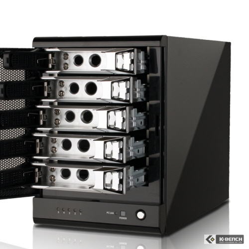

## Linux HardDisk

`이것이 리눅스다 개정판 with RedHat CentOS 8` 교재 기반 학습


### 0. IDE와 SCSI


출처 : https://jerrystyle.tistory.com/46


기본적으로 우리가 운영하는 Server는 위와 같이 구성된다. 


> 요즘에는 PC용 하드디스크나 CD/DVD 장치로 IDE 대신 SATA(Serial ATA)를, 서버용으로 SCSI 대신 SA-SCSI(Serial Attached SCSI, 줄여서 SAS)를 주로 사용한다. SCSI가 최대 16개 장치를 연결할 수 있었다면, SA-SCSI는 최대 65,535개까지 연결할 수 있다.


#### IDE

> 일반적으로 PC에서 사용되는 하드디스크나 CD/DVD 장치가 IDE장치(또는 EIDE 장치)나 SATA 장치라고 생각하면 된다. 
>
> 메인보드의 IDE 0, IDE 1슬롯에는 각각 2개의 IDE 장치를 장착할 수 있다. 결과적으로 IDE 장치는 총 4개를 장착할 수 있다.


#### SCSI

> 서버용으로 주로 SCSI 하드디스크를 사용한다. SSD 형태의 플래시 메모리를 사용할 수 있는 NVMe장치도 제공된다.
>
> SCSI는 총 16개의 장치를 연결할 수 있다. (VMware에서는 1개를 가상머신에서 사용하므로 15개 사용 가능)


본 실습환경에서는 Windows OS 상에서 VMware Workstation 15 Player(Non-commercial use only) 가상머신 위에 Linux CentOS 7 64-bit로 실습한다.


### 1. 하드디스크 추가하기

> VMware에서 왼쪽 하단 Add-하드디스크 선택


> SCSI 체크로 설정 진행


> HardDisk 추가 완료




> /dev/ 디렉토리 내 디스크 탐색(ls -l /dev/sd*)




> Disk 파티션 생성 -> fd(Linux raid autodetect) 파일 시스템 지정

> $ fdisk /dev/sdb	-> [SCSI 0:1] 하드디스크 선택
>
> Command: n	-> 새로운 파티션 분할
>
> Select: p	-> Primary 파티션 선택
>
> Partition Number: 1 	-> 파티션 번호 1번 선택 
>
> First sector: `enter`	-> 시작 섹터 번호
>
> Last sector: `enter`	-> 마지막 섹터 번호
>
> Command: t 	-> 파일 시스템 유형 선택
>
> Hex Code: fd 	-> 'Linux raid autodetect'유형 번호(L을 입력하면 전체 유형 출력)
>
> Command: p	-> 설정 내용 확인
>
> Command: w	-> 설정 저장

```bash
$ fdisk /dev/sdb
Welcome to fdisk (util-linux 2.23.2).

Changes will remain in memory only, until you decide to write them.
Be careful before using the write command.

Device does not contain a recognized partition table
Building a new DOS disklabel with disk identifier 0xd7447f8c.

Command (m for help): n
Partition type:
   p   primary (0 primary, 0 extended, 4 free)
   e   extended
Select (default p): p
Partition number (1-4, default 1): 1
First sector (2048-2097151, default 2048): 
Using default value 2048
Last sector, +sectors or +size{K,M,G} (2048-2097151, default 2097151): 
Using default value 2097151
Partition 1 of type Linux and of size 1023 MiB is set

Command (m for help): p

Disk /dev/sdb: 1073 MB, 1073741824 bytes, 2097152 sectors
Units = sectors of 1 * 512 = 512 bytes
Sector size (logical/physical): 512 bytes / 512 bytes
I/O size (minimum/optimal): 512 bytes / 512 bytes
Disk label type: dos
Disk identifier: 0xd7447f8c

   Device Boot      Start         End      Blocks   Id  System
/dev/sdb1            2048     2097151     1047552   83  Linux

Command (m for help): w
The partition table has been altered!

Calling ioctl() to re-read partition table.
Syncing disks.
```

> #fdisk
>
> Command
>
> ...


### 2. 생성한 하드디스크 포멧

```bash
# mkfs.ext4 /dev/sdb1
 
```

```bash
# mkdir /mydata
# cd /mydata
# touch mydata.txt
# cd
# mount /dev/sdb1 /mydata
```


> /mydata 디렉토리에 새로운 파일이 생성되면 sdb1에 파일이 저장되고, 이후 마운트를 해제하면 mydata 디렉토리에서 파일이 사라지고 sdb1에 저장되어 있다.


### 3. 마운트 해제

```bash
# umount /dev/sdb1
```

> 기존 마운트 상태를 해제하고 싶다면 umount 커맨드를 사용한다.

### 4. 재부팅시 마운팅 유지하기

```bash
$ vi /etc/fstab
#들어가서 맨 뒤에 /dev/sdb1 /mydata ext4 defaults 0 0
#적어주고 나오기
```

## RAID의 정의와 개념

> 여러개의 하드디스크를 하나의 하드디스크처럼 사용하는 방식이다. 비용을 절감하면서도 신뢰성을 높이며 성능까지 향상시킬 수 있다.
>
> RAID의 종류는 크게 하드웨어 RAID와 소프트웨어 RAID로 나눌 수 있다.


### 1. 하드웨어 RAID



> 하드웨어 RAID는 여러 개의 하드디스크를 연결한 장비를 만들어 그 자체를 공급하는 것이다. 하드웨어 RAID는 좀 더 안정적이고 각 제조업체에서 기술 지원을 받을 수 있기에 많이 선호하는 방법이다.


### 2. 소프트웨어RAID

> 고가 하드웨어 RAID의 대안으로, 하드디스크만 여러 개 있으면 운영체제에서 지원하는 방식으로 RAID를 구성하는 방법을 말한다. 하드웨어 RAID와 비교하면 신뢰성이나 속도 등이 떨어질 수 있지만, 아주 저렴한 비용으로 좀 더 안전하게 데이터를 저장할 수 있다.


### 3. RAID 레벨


출처: https://jerrystyle.tistory.com/56


#### Linear RAID와 RAID 0

> 두 방식 모두 2개 이상의 하드디스크를 1개의 볼륨으로 사용한다. 그러나 저장 방식은 다르다. Linear RAID는 앞 하드디스크에 데이터가 완전히 저장되면 다음 하드디스크에 데이터를 저장한다. 이와 달리 RAID 0 방식은 모든 하드디스크를 `동시에` 사용한다.

동시에라는 말은 중요한 의미가 있다. Linear RAID에서의 저장보다 RAID 0에서는 동시에 하드디스크 3개를 사용하므로 속도가 매우 빠르다. 여러 개의 하드디스크에 동시에 저장되는 방식을 `스트라이핑(Stripping)` 방식이라고 부른다.

#### RAID 1

> RAID 1의 가장 큰 특징은 `미러링(Mirroring)`이다. 하드디스크를 똑같이 복제해 거울을 만들어 놓는 것이다. 안정적이지만 총 하드디스크 용량의 절반밖에 사용하지 못한다.

#### RAID 5

> RAID 5의 가장 큰 특징은 `패리티(parity)`이다. RAID 0와 RAID 1을 의 장점인 속도와 안정성을 모두 가져가면서,  하드디스크 복구도 패리티 특성을 쉽게 이용 가능하다. 그러나 2개 이상의 하드 디스크에 오류가 발생하면 복구가 불가능하다.

#### RAID 6

> RAID 6는 RAID 5의 단점인 단일 패리티 결함을 보완하여 복수의 패리티를 사용한다.

현업에서는 환경에 따라 속도와 안정성을 모두 추구하기 위해 RAID 0와 RAID 1을 함께 사용하거나 RAID1과 RAID5를 함께 사용하기도 한다. 안정성, 속도 등의 다양한 요인을 고려하여 RAID 방식을 달리 사용한다.


### 4. RAID 실습

> #### VMware에서 Disk를 9개 생성해주고 server 실행!
>
> 

```bash
$ ls -l /dev/sd*
brw-rw---- 1 root disk 8,   0  9월 21 11:09 /dev/sda
brw-rw---- 1 root disk 8,   1  9월 21 11:09 /dev/sda1
brw-rw---- 1 root disk 8,   2  9월 21 11:09 /dev/sda2
brw-rw---- 1 root disk 8,  16  9월 21 11:09 /dev/sdb
brw-rw---- 1 root disk 8,  32  9월 21 11:09 /dev/sdc
brw-rw---- 1 root disk 8,  48  9월 21 11:09 /dev/sdd
brw-rw---- 1 root disk 8,  64  9월 21 11:09 /dev/sde
brw-rw---- 1 root disk 8,  80  9월 21 11:09 /dev/sdf
brw-rw---- 1 root disk 8,  96  9월 21 11:09 /dev/sdg
brw-rw---- 1 root disk 8, 112  9월 21 11:09 /dev/sdh
brw-rw---- 1 root disk 8, 128  9월 21 11:09 /dev/sdi
brw-rw---- 1 root disk 8, 144  9월 21 11:09 /dev/sdj

```

#### 4.1. 파티션 생성,  파일 시스템 지정(fd: Linux raid autodetect)

> Disk 파티션 생성 -> fd(Linux raid autodetect) 파일 시스템 지정
>
> #### sdb~sdj까지 반복 진행

> $ fdisk /dev/sdb	-> [SCSI 0:1] 하드디스크 선택
>
> Command: n	-> 새로운 파티션 분할
>
> Select: p	-> Primary 파티션 선택
>
> Partition Number: 1 	-> 파티션 번호 1번 선택 
>
> First sector: `enter`	-> 시작 섹터 번호
>
> Last sector: `enter`	-> 마지막 섹터 번호
>
> Command: t 	-> 파일 시스템 유형 선택
>
> Hex Code: fd 	-> 'Linux raid autodetect'유형 번호(L을 입력하면 전체 유형 출력)
>
> Command: p	-> 설정 내용 확인
>
> Command: w	-> 설정 저장

```bash
$ fdisk /dev/sdb
Welcome to fdisk (util-linux 2.23.2).

Changes will remain in memory only, until you decide to write them.
Be careful before using the write command.

Device does not contain a recognized partition table
Building a new DOS disklabel with disk identifier 0x8672909f.

Command (m for help): n
Partition type:
   p   primary (0 primary, 0 extended, 4 free)
   e   extended
Select (default p): p
Partition number (1-4, default 1): 1
First sector (2048-4194303, default 2048): 
Using default value 2048
Last sector, +sectors or +size{K,M,G} (2048-4194303, default 4194303): 
Using default value 4194303
Partition 1 of type Linux and of size 2 GiB is set

Command (m for help): t
Selected partition 1
Hex code (type L to list all codes): fd
Changed type of partition 'Linux' to 'Linux raid autodetect'

Command (m for help): p

Disk /dev/sdb: 2147 MB, 2147483648 bytes, 4194304 sectors
Units = sectors of 1 * 512 = 512 bytes
Sector size (logical/physical): 512 bytes / 512 bytes
I/O size (minimum/optimal): 512 bytes / 512 bytes
Disk label type: dos
Disk identifier: 0x8672909f

   Device Boot      Start         End      Blocks   Id  System
/dev/sdb1            2048     4194303     2096128   fd  Linux raid autodetect

Command (m for help): w
The partition table has been altered!

Calling ioctl() to re-read partition table.
Syncing disks.

```

#### 4.2. Linear RAID 구축

```bash
$ mkdir /md9
# RAID 디렉토리 생성

$ mdadm --create /dev/md9 --level=linear --raid-devices=2 /dev/sdb1 /dev/sdc1
# /dev/md9로 레이드를 만드는데, linear레벨로 2장의 하드디스크로 만든다. 디스크는 sdb1과 sdc1이다.

# RAID 0 구축 예시()
$ mdadm --create /dev/md9 --level=0 --raid-devices=2 /dev/sdd1 /dev/sde1
# RAID 0 구축(level만 바꿔주면 다른 레벨의 RAID를 생성할 수 있다)


$ mkfs.ext4 /dev/md9
# /dev/md9 파티션 장치의 파일 시스템 생성(포맷)

$mkdir /raidLinear
#마운트할 디렉터리 생성

$ mount /dev/md9 /raidLinear
# 마운트

$ vi /etc/fstab
/dev/md9 /raidLinear ext4 defaults 0 0 추가
# /etc/fstab 설정 변경(재부팅해도 마운트 유지)

$ df
Filesystem     1K-blocks    Used Available Use% Mounted on
devtmpfs         1914924       0   1914924   0% /dev
tmpfs            1930648       0   1930648   0% /dev/shm
tmpfs            1930648   12828   1917820   1% /run
tmpfs            1930648       0   1930648   0% /sys/fs/cgroup
/dev/sda2       37729284 5286876  32442408  15% /
tmpfs             386132      24    386108   1% /run/user/0
/dev/sr0         4669162 4669162         0 100% /run/media/root/CentOS 7 x86_64
/dev/md9         3024752    9216   2842176   1% /raidLinear
# RAID 확인
```

#### 4.3. RAID 제거

> 1. /etc/fstab에 작성한 내용 삭제
> 2. 마운트 해제(umount /dev/md9)
> 3. RAID STOP(mdadm --stop /dev/md9[삭제하고자 하는 RAID])

#### 4.4. RAID 조회

##### 4.4.1. 디스크 조회

```bash
$df
```

##### 4.4.2. RAID 상세 조회

```bash
$mdadm --detail /dev/md9
```


### 5. Disk 복구 실습

#### 5. 1. 복구 실습


> 각 레이드 특성에 따른 디스크 고장 상황을 연출하여 디스크 복구를 실습한다.

```bash
$ cp /boot/vmlinuz-3* /raidLinear/testFile
$ cp /boot/vmlinuz-3* /raid0/testFile
$ cp /boot/vmlinuz-3* /raid1/testFile
$ cp /boot/vmlinuz-3* /raid5/testFile
#각 레이드 폴더 내에 testfile 저장

$poweroff

#이후 다시 VMware-edit settings-disk 삭제
#본 실습에서는 disk 2, 4, 6, 9 제거
#고장 발생!!!!

$vi /etc/fstab
#RAID 구문 모두 주석처리

$reboot

# 자동마운트를 주석처리로 풀었기 때문에 정상 부팅

$ls /dev/md*
/dev/md0  /dev/md1  /dev/md5  /dev/md9
# md0: RAID0
# md1: RAID1
# md5: RAID5
# md9: RAID Linear
# md0, md9은 특성상 복구 불가함!

$mdadm --stop /dev/md9
$mdadm --stop /dev/md0
$poweroff
#복구 불가능한 RAID 폴더 삭제


# 복구 작업 Start!!
# VMware 실행 후 edit settings -> new Disk 2, 4, 6, 9 만들어 줌.

$fdisk /dev/sdc
$fdisk /dev/sde
$fdisk /dev/sdg
$fdisk /dev/sdi

#실행할 해결 방법
#linear Raid - 새롭게 만든다
#RAID 0 - 새롭게 만든다
#RAID 1 - 디스크를 추가
#RAID 5 - 디스크를 추가

$mdadm --stop /dev/md9
$mdadm --stop /dev/md9
# 기존 RAID 삭제(Linear, 0)

$mdadm --create /dev/md9 --level=linear --raid-devices=2 /dev/sdb1 /dev/sdc1
$mkfs.ext4 /dev/md9
#새 RAID 추가(Linear)

$mdadm --create /dev/md0 --level=0 --raid-devices=2 /dev/sdd1 /dev/sde1
$mkfs.ext4 /dev/md0
#새 RAID 추가(RAID 0)

$mount /dev/md9 /raidLinear
$mount /dev/md0 /raid0
#RAID 0, Linear RAID 마운트

$mdadm /dev/md1 --add /dev/sdg1
$mdadm /dev/md5 --add /dev/sdi1
#기존 RAID 1, RAID 5에 새 디스크 추가

$vi /etc/fstab
#자동마운트 주석 해제
```

> 결과


결과적으로 새로 생성된 RAID Linear에는 기존 testFile이 존재하지 않고, RAID1에는 testFile이 정상적으로 남아있는 것을 확인 할 수 있다.


#### 5.2. 결과

> 지금은 RAID 1과 RAID 5의 데이터를 정상적으로 복구할 수 있었지만, 만약 정상 작동 중인 다른 하드디스크까지 고장 난다면 영구히 복구할 수 없게 된다. 그러므로 될 수 있으면 빨리 고장 난 하드디스크를 제거하고 새로운 하드디스크로 교체해줘야 한다.
>
> 또 Linear RAID와 RAID 0의 구성은 원상 복구할 수 있지만, 당연히 그 안의 데이터는 살릴 수 없다.


### 6. 복합 RAID 실습

```bash
$mdadm --create /dev/md1 --level=1 --raid-devices=2 /dev/sdf1 /dev/sdg1
$mdadm --create /dev/md2 --level=1 --raid-devices=2 /dev/sdh1 /dev/sdi1
# level 1 RAID 2개 생성
$mdadm --create /dev/md10 --level=0 --raid-devices=2 /dev/md1 /dev/md2
# RAID md1, md2를 가지고 level 0 RAID 생성
$mkdir /raid10
# RAID 디렉토리 생성
$mount /dev/md10 /raid10
# mount
$vi /etc/fstab
# automount 설정
$cp /boot/vmlinuz-3* /raid10/testFile
# RAID에 testFile 생성

$poweroff
## 전원 끄고 나와서 VMware에서 6, 8번 Disk Remove
## 전원 시작

```

```bash
$df
Filesystem     1K-blocks    Used Available Use% Mounted on
devtmpfs         1914924       0   1914924   0% /dev
tmpfs            1930648       0   1930648   0% /dev/shm
tmpfs            1930648   12920   1917728   1% /run
tmpfs            1930648       0   1930648   0% /sys/fs/cgroup
/dev/sda2       37729284 5292604  32436680  15% /
/dev/md10        2023376   12728   1889816   1% /raid10
tmpfs             386132       8    386124   1% /run/user/42
tmpfs             386132      28    386104   1% /run/user/0
/dev/sr0         4669162 4669162         0 100% /run/media/root/CentOS 7 x86_64

##raid10이 여전히 살아있고, 데이터도 남아있음.
##2개의 Disk가 고장난 상태기에 상태는 정상 X
##새 Disk로 교체해주어야 함.
##sdg=6번, sdh=8번
## 복구과정은 Disk 5.1의 내용과 같음
```


raid2server

- 모든 구성을 지우고
- reboot

p402 raid 1+6 구조를 구성하시오