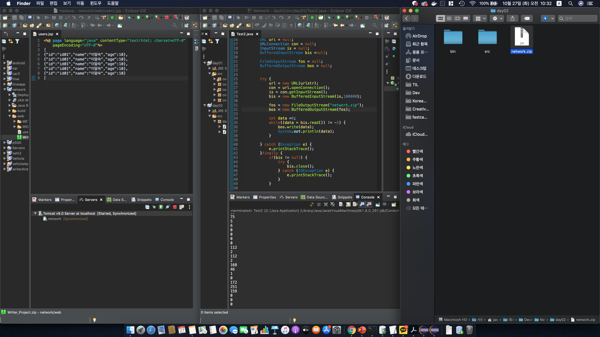
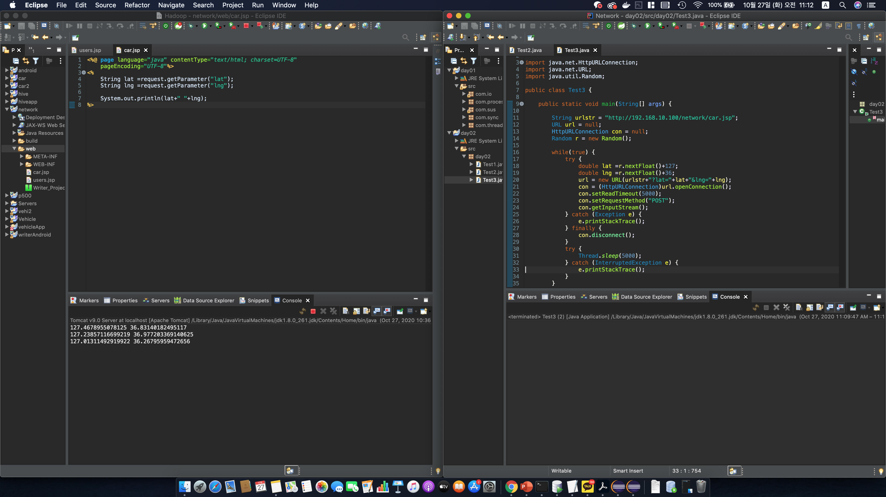
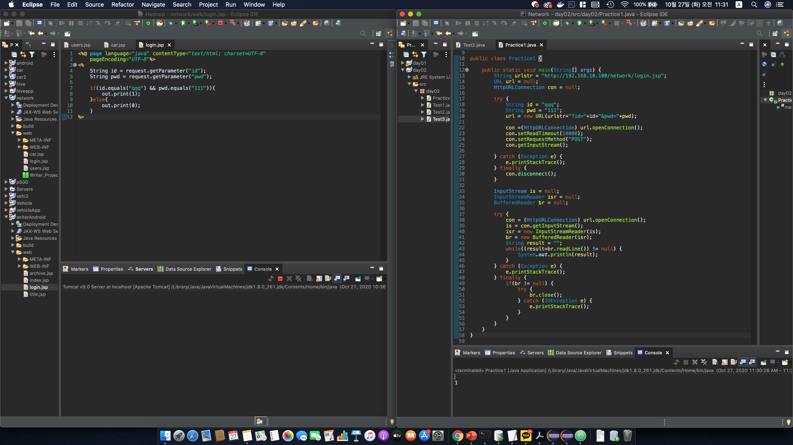
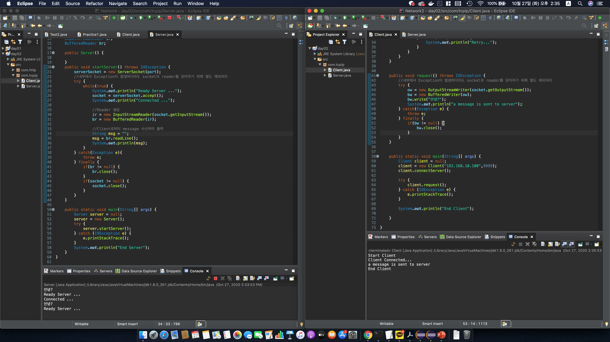

# 네트워크 통신 실습(Http, TCP/IP)

일시: 2020년 10월 27일

## 1. HTTP 네트워크 구현 실습

### 1.1. Server로부터 메시지 수신

> com.http 패키지 내 Test1.java

<br/>

서버에 접근해 텍스트 데이터를 받아와 출력한다.

<br/>

* Server Code

```jsp
<%@ page language="java" contentType="text/html; charset=UTF-8"
    pageEncoding="UTF-8"%>
[
{"id":"id01","name":"이말숙","age":10},
{"id":"id01","name":"이말숙","age":10},
{"id":"id01","name":"이말숙","age":10},
{"id":"id01","name":"이말숙","age":10},
{"id":"id01","name":"이말숙","age":10}
]
```

<br/>

* 구현 결과


<br/><br/>

### 1.2. Server와 파일 수신

> com.http 패키지 내 Test2.java

<br/>

서버의 웹 디렉토리 내부에 Writer_Project.zip 파일을 넣어놓고, 이에 접근해 network.zip이라는 이름으로 파일을 다운받는다.

<br/>

* 구현 결과



<br/><br/>

### 1.3. Server로 메시지 송신

> com.http 패키지 내 Test3.java

<br/>

Client인 Test3에서 값을 임의로 생성해 Server로 전송하고, Server는 이를 콘솔에 출력한다.

<br/>

* Server Code

```jsp
<%@ page language="java" contentType="text/html; charset=UTF-8"
    pageEncoding="UTF-8"%>
<%
	String lat =request.getParameter("lat");
	String lng =request.getParameter("lng");
	
	System.out.println(lat+" "+lng);
%>
```

<br/>

* 구현 결과



<br/><br/>

### 1.4. Server와 메시지 송수신

> com.http 패키지 내 Practice1.java

<br/>

Client인 Practice1에서 id와 pwd를 Server로 전송하는데, Server는 이를 받아 검증한다. 만일 받아온 id와 pwd가 각각 "qqq", "111"이 맞다면 Client로 로그인 성공 메시지인 "1"을 전송한다. 반대로 해당 값이 아니면 Client로 로그인 실패 메시지인 "0"을 전송한다. 이후 Client는 이를 받아 콘솔에 로그인 결과를 출력한다.

<br/>

* Server Code

```jsp
<%@ page language="java" contentType="text/html; charset=UTF-8"
    pageEncoding="UTF-8"%>
<%
	String id = request.getParameter("id");
	String pwd = request.getParameter("pwd");
	
	if(id.equals("qqq") && pwd.equals("111")){
		out.print(1);
	}else{
		out.print(0);
	}
%>
```

<br/>

* 구현 결과



<br/><br/><br/>

## 2. TCP/IP 네트워크 구현 실습

>  본 프로젝트 디렉토리의 com.tcpip 패키지 내 Server.java와 <br/>
>
> [여기](https://github.com/socialDe/TIL/tree/master/Learned_Contents/Network2/day02)의 com.tcpip 패키지 내 Client.java

<br/>

TCP/IP를 활용한 소켓 프로그래밍으로 Client와 Server를 구현한다.

Server는 실행되면 Client의 접속을 계속해서 기다리고, Client가 접속해 메시지를 전달하면 이를 console에 출력한 뒤, 계속해서 다른 Client의 접속을 기다린다. Client는 Server로 접속하는데 만약 실패할 경우 다시 한 번 시도하고, 5초의 간격마다 계속 접속을 시도한다.

이 Server, Client 프로그램은 Thread를 구현하지 않았으므로 1:n, n:1, n:n 통신을 지원하지 않는다.

<br/>

<br/>

* 구현 결과



